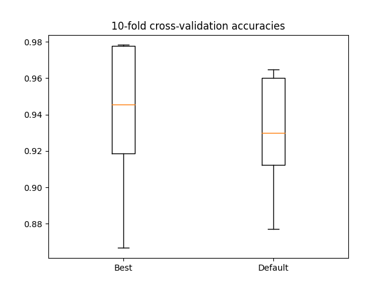

# Optimization of KNN parameters

## Requirements

- [Python](https://www.python.org/downloads/) >= 3.6
- [pip](https://pip.pypa.io/en/stable/installing/)
- pipenv: ```pip install pipenv```

## Installation

Install all the required dependencies with following command: ```pipenv shell```.

## Run example

Firstly enter ```pipenv shell``` and then execute ```python run.py```.

Below is the generated chart of the performance comparison between default classifier and classifier with optimal parameter settings.

